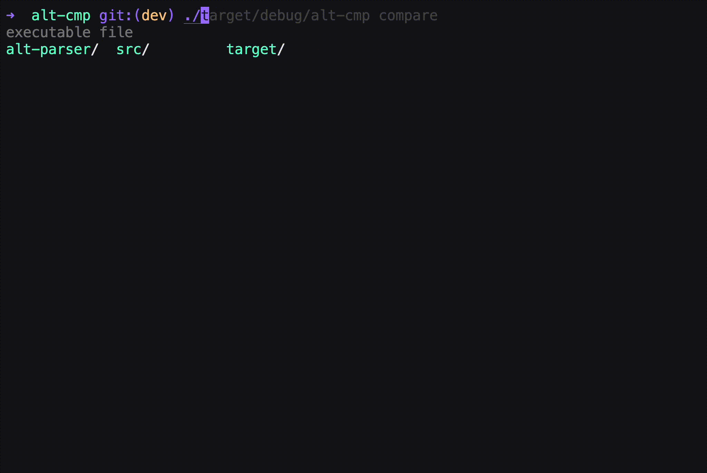

# alt-cmp

`alt-cmp` is a Rust-based command-line tool designed to compare package versions between ALT Linux Sisyphus and other repositories (e.g., Proxmox). It fetches package lists, parses them, and provides a detailed comparison or statistical summary of package versions. The tool supports colorful terminal output, file exports, and customizable filtering options.



## Features

- **Fetch Package Lists:** Download and decompress package lists from specified URLs (e.g., `.xz` files for ALT Linux or plain text for other repositories).
- **Compare Versions:** Display a side-by-side comparison of package versions between ALT Linux and a second repository.
- **Filter Results:** Show only packages where ALT or the second repository has a newer version.
- **Statistics:** Generate a summary of version differences (newer, equal, missing).
- **Output Options:** Export results to a file or display them in the terminal with styled formatting.
- **Custom Mapping:** Use a package mapping file to align package names between repositories.

## Installation

### **Prerequisites**

- **Rust** (stable version recommended)
- **A working internet connection** to fetch package lists

### **Steps**

1. **Clone the repository:**
```bash
git clone https://github.com/<your-username>/alt-cmp.git
cd alt-cmp
```
2. **Build the project:**
```bash 
cargo build --release
```

3. **Run the tool:**
```bash
./target/release/alt-cmp --help
```

## Usage

The tool supports three main commands: `compare`, `fetch`, and `stats`. Below are examples of how to use them.

### Command Line Options

```bash
Usage: alt-cmp [OPTIONS] <COMMAND>

Commands:
  compare  Compare all packages and display full comparison table
  fetch    Fetch and save package lists without comparison
  stats    Display statistics about package versions
  help     Print this message or the help of the given subcommand(s)

Options:
  -o, --output-file <FILE>           Path to the output file (if not specified, outputs to console)
      --alt-url <ALT_URL>            URL for the ALT Linux package list (default: Sisyphus bin.list.xz) [default: https://ftp.altlinux.org/pub/distributions/ALTLinux/Sisyphus/files/list/bin.list.xz]
      --second-url <SECOND_URL>      URL for the second repository package list (e.g., Proxmox) [default: http://download.proxmox.com/debian/pve/dists/bookworm/pve-no-subscription/binary-amd64/Packages]
  -m, --mapping-file <MAPPING_FILE>  Path to the package mapping file [default: package_mapping.txt]
  -s, --silent                       Silent mode (suppress console output except errors)
  -h, --help                         Print help
  -V, --version                      Print version
```

## Examples

### 1. **Compare Package Versions**

Compare all packages between ALT Linux and Proxmox, showing the full table in the terminal:

```bash
alt-cmp compare
```

Filter to show only packages where ALT has a newer version:
```bash
alt-cmp compare --alt-newer
```

Save the comparison to a file instead of displaying it:
```bash
alt-cmp compare -o comparison.txt
```

### 2. **Fetch Package Lists**

Download package lists and save them to a directory:
```bash
alt-cmp fetch -d ./package_lists
```

### 3. **Display Statistics**

Show a statistical summary of version differences:
```bash
alt-cmp stats
```
Get a detailed breakdown:
```bash
alt-cmp stats --detailed
```

### **Package Mapping File**

The tool uses a `package_mapping.txt` file to map package names between repositories. Each line should contain two space-separated names:
```
package-alt package-second
libexample-alt libexample-proxmox
```

If package names are identical across repositories, they can be listed as the same:
```
common-package common-package
```